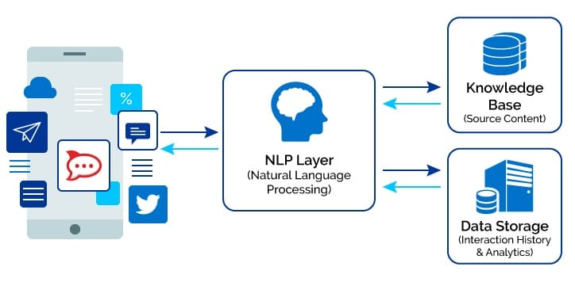

# **Natural Language Processing Chatbot**

NLP is a tool for computers to analyze, comprehend, and derive meaning from natural language in an intelligent and useful way. This goes way beyond the most recently developed chatbots and smart virtual assistants. In fact, natural language processing algorithms are everywhere from search, online translation, spam filters and spell checking.
<br><br>
So, by using NLP, developers can organize and structure the mass of unstructured data to perform tasks such as intelligent:
<br><br>
- **Automatic summarization** (intelligently shortening long pieces of text)
- **Automatic suggestions** (used to speed up writing of emails, messages, and other texts)
- **Translation** (translating phrases and ideas instead of word for word)
- **Named entity recognition** (used to locate and classify named entities in unstructured natural languages into pre-defined categories such as the organizations; person names; locations; codes; quantities; price; time; percentages)
- **Relationship extraction** (extraction of semantic relationships among the identified entities in natural language text/speech such as “is located in”, “is married to”, “is employed by”, “lives in”, etc.)
- **Sentiment analysis** (helps identify, for instance, positive, negative and neutral opinion form text or speech widely used to gain insights from social media comments, forums or survey responses)
- **Speech recognition** (enables computers to recognize and transform spoken language into text - dictation - and, if programmed, act upon that recognition - e.g. in case of assistants like Google Assistant Cortana or Apple’s Siri)
- **Topic segmentation** (automatically divides written texts, speech or recordings into shorter, topically coherent segments and is used in improving information retrieval or speech recognition)

<br><br>

<br><br>

## *Here are some of the most important elements of an NLP-powered chatbot:*

- **Dialogue Management:** This tracks the state of the conversation. The core components of dialogue management in chatbots include a context—saving and sharing data exchanged in the conversation—and session—one conversation from start to finish.

- **Human Handoff:** This refers to the seamless communication and execution of a handoff from the chatbot to a human agent.

- **Business Logic Integration:** It’s important that your chatbot has been programmed with your company’s unique business logic.

- **Rapid Iteration:** You want your bot to be slick and easily programmable. Rapid iteration refers to the fastest route to the right solution.

- **Training and Iteration:** To ensure your chatbot doesn’t go awry, it’s necessary to systematically train and send feedback to improve its understanding of customer intents using real-world conversation data being generated across channels.

- **Natural Language Processing:** Your chatbot’s NLP works off the following keys: utterances (ways the user refers to a specific intent), intent (the meaning behind the words a user types), entity (details that are important to the intent like dates and locations), context (which helps to save and share parameters across a session), and session (one conversation from start to finish, even if interrupted).

- **Simplicity:** To get the most out of your bot, you’ll want it to be set up as simply as possible, with all the functionality that you need—but no more than that. There is, of course, always the potential to upgrade or add new features as you need later on.

<br><br>
## **Components:**
- **ml܁py:** Loading natural language data and create deep neural network or XGBoost model
- **gui܁py:** Chatbot graphical user interface
- **bot܁py:** chatbot core service
- **classes.pkl:** Different response classes
- **words.pkl:** pattern recognition words
- **intents.json:** word patterns and tags mapping
- **model.h5:** neural network trained model 
- **model.json:** XGBoost trained model 
- **settings.py:** Application settings


## **Requirements**
- install python nltk, numpy, tensorflow packages
- download nltk 'punkt', 'wordnet', 'omw-1.4' and 'stopwords' corpus  

## **How to run**
After download the repository files, go to project folder and run main.py python script
```
$ python main.py
```


